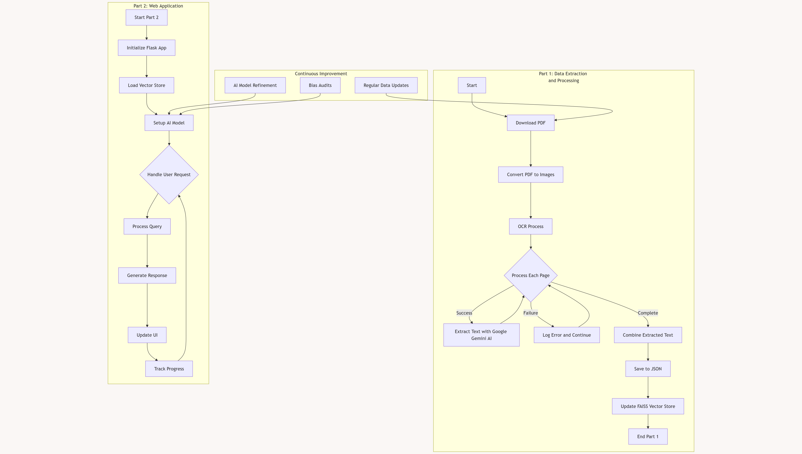
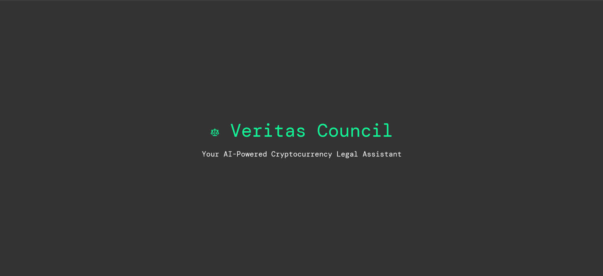
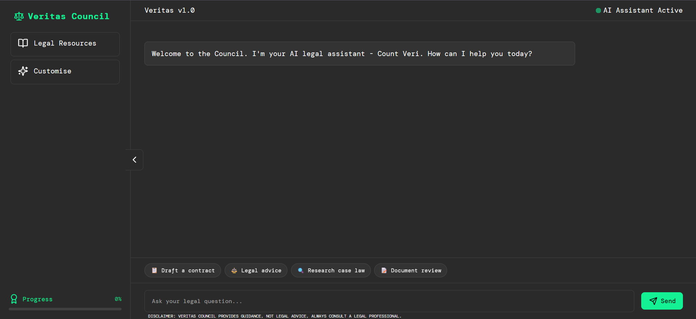
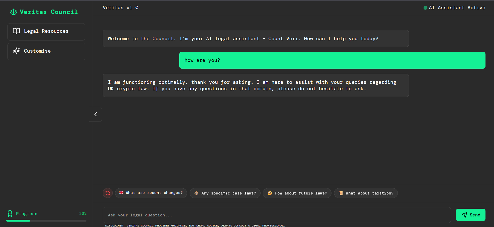
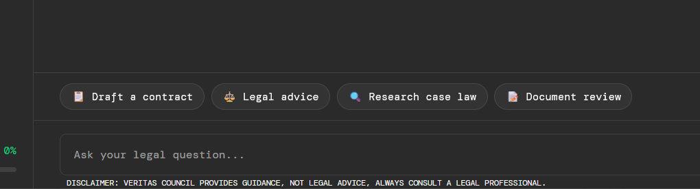
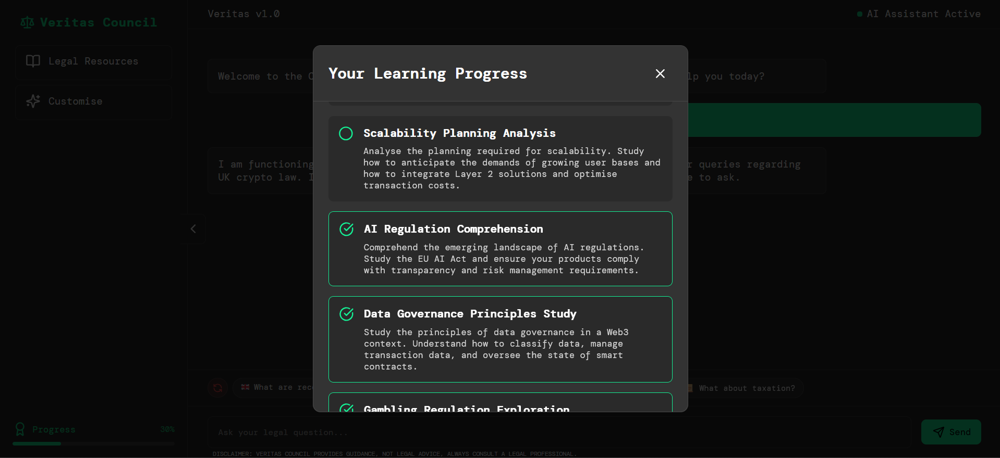
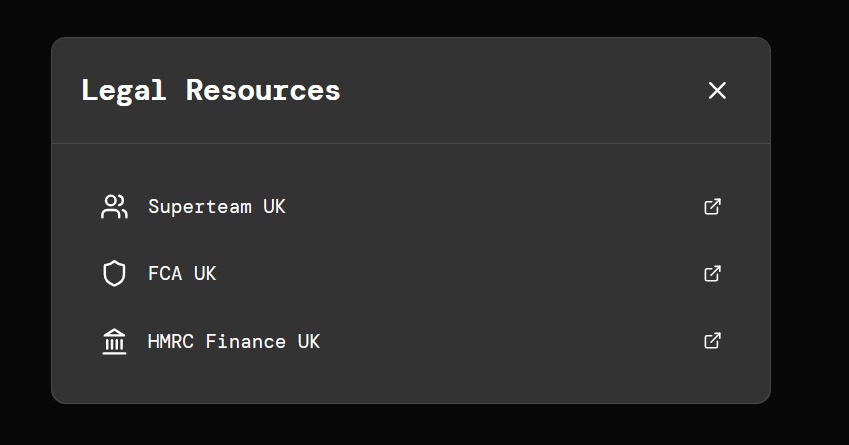
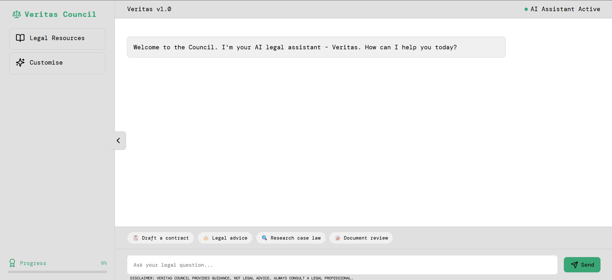
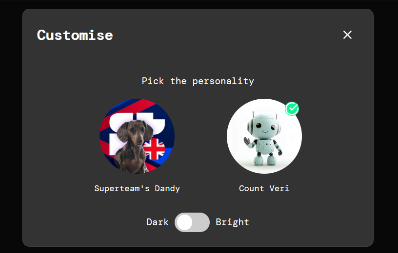

# Veritas Council

## About

Veritas Council is an advanced web application built on Python 3.10, harnessing the power of Google's Generative AI API to provide guidance on crypto laws in the UK. It features a two-part system that combines sophisticated PDF processing and OCR capabilities with an interactive AI-powered chat interface.

### Disclaimer: This application does NOT provide legal advice. Always consult a legal professional for legal matters.

## Technologies

- Python 3.10 
- Docker
- Google Cloud Platform (GCP)
- Generative AI API
- LangChain
- Flask
- FAISS Vector Store
- PyMuPDF
- HTML/CSS/JavaScript

## Architecture

Veritas Council consists of two main components:

1. Data Extraction and Processing:
   - Downloads and processes PDF documents
   - Converts PDF pages to images
   - Performs OCR using Google Gemini 2 Flash Experimental
   - Stores extracted text in a structured JSON format

2. Web Application:
   - Flask backend for request handling
   - FAISS vector store for efficient information retrieval
   - Integration with Google's Generative AI for query processing
   - Interactive frontend with real-time chat and customization options

## Architecture Preview


## Key Features

- PDF processing with no strict size limit, handling large documents efficiently
- Robust OCR process with error handling for failed page extractions
- Dynamic FAISS vector store updates to reflect changes in source documents
- Multi-user support with efficient request handling
- User progress tracking and personalized experience
- Theme customization and AI personality selection

## Data Management and Privacy

- User conversations are not permanently stored to ensure privacy
- Vector store contains only processed legal information, not user data
- Regular updates to the legal information database to ensure accuracy and currency (refer to part 1 of system)

## Scalability and Performance

- Dockerised application for easy deployment and scaling
- Efficient vector search for quick information retrieval
- Asynchronous processing of user requests for improved performance under load

## Setup

This application can be run locally or using Docker. For compatibility and ease of deployment, I recommend using the Docker version.

### Docker Setup (Recommended)

1. Ensure you have Docker installed on your system.
2. Enable the Generative AI API in your Google Cloud Console:
   https://console.cloud.google.com/apis/api/generativelanguage.googleapis.com/overview?project={project_id}
3. Obtain your Google API Key. [Tutorial Video](https://www.youtube.com/watch?v=brCkpzAD0gc)
4. Build the Docker image:
   ```
   docker build -t veritas-council .
   ```
5. Run the Docker container:
   ```
   docker run -p 80:80 -e GOOGLE_API_KEY={ENTER YOUR GOOGLE API KEY HERE} veritas-council
   ```

The application will be accessible on port 80, which is the default HTTP port. This setup is ready for deployment and can be easily deployed on AWS ECR/ECS for instant web browsing.

### Local Setup

1. Install the Google Cloud CLI (gcloud).
2. Authenticate using:
   ```
   gcloud auth application-default login
   ```
3. Install the required dependencies (check requirements.txt).
4. Enable the Generative AI API in your Google Cloud Console:
   https://console.cloud.google.com/apis/api/generativelanguage.googleapis.com/overview?project={project_id}
5. Obtain your Google API Key. [Tutorial Video](https://www.youtube.com/watch?v=brCkpzAD0gc)
6. Create a `.env` file in the root directory of the project.
7. Add your Google API Key to the `.env` file:
   ```
   GOOGLE_API_KEY=your_api_key_here
   ```

## Deployment

The Docker version of this application is ready for deployment. It can be easily deployed on AWS ECR/ECS, allowing for instant browsing on the web.

## Website Preview











## Questions and Support

If you have any questions or need support, please contact me - @rushnrx on Discord.